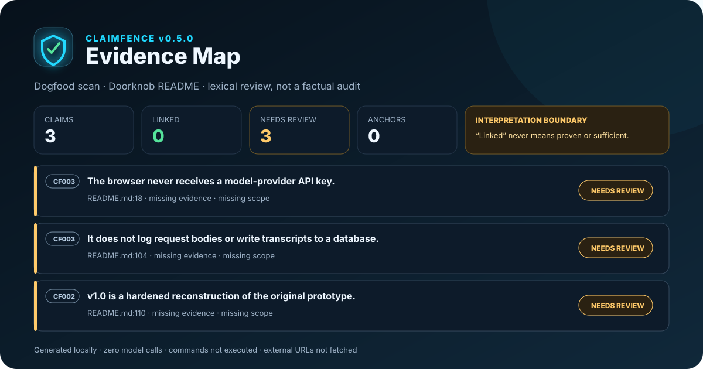
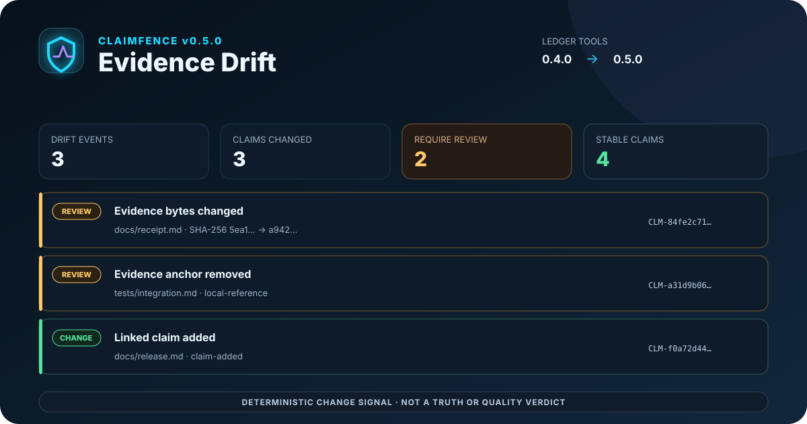

<p align="center">
  
</p>

<h1 align="center">ClaimFence</h1>

<p align="center"><strong>A deterministic linter for evidence-bound claims in technical documentation.</strong></p>

<p align="center">
  <a href="https://github.com/Dean00dev/ClaimFence/actions/workflows/ci.yml"></a>
  
  <a href="LICENSE"></a>
  
</p>

Technical projects often make their strongest claims in the least tested file: the README.
ClaimFence scans Markdown for assurance language and checks whether nearby text exposes
scope, evidence, limitations, or a reproduction path.

It does **not** decide whether a claim is true. It finds claims whose documentation does
not show readers how to evaluate them.

## The difference it looks for

```diff
- The gateway prevents attacks and is production-ready.
+ Under v0.3 with the included malformed-token fixtures, the gateway blocks the
+ tested cases. Reproduce with `PYTHONPATH=src python -m unittest discover -s tests -v`;
+ see the [verification evidence](docs/EVIDENCE.md).
+ This does not establish security against untested inputs or modified deployments.
```

ClaimFence turns the first form into an actionable finding. The second form names a
version, test space, reproduction command, evidence location, and limitation.

## The Evidence Map

ClaimFence v0.5 inventories every assurance claim it recognizes—not only the ones that
fail—and maps each claim to its nearby scope, limitations, commands, URLs, and local
evidence files. Local files receive a SHA-256 digest when the map is generated. The result
is available as deterministic JSON and as a self-contained interactive HTML report.

<p align="center">
  
</p>

This is a dogfood result from the author's own Doorknob README. It is deliberately not a
score: `linked` means the expected lexical context and a concrete anchor were detected.
It does **not** mean the claim is true or the evidence is sufficient.

```bash
claimfence README.md docs --fail-on none \
  --ledger-output claimfence-ledger.json \
  --html-output claimfence-map.html
```

The ledger follows the versioned
[`claim-ledger-v1` schema](schema/claim-ledger-v1.schema.json). Commands are recorded but
never executed, external URLs are recorded but never fetched, and local hashes establish
byte identity rather than evidence quality. See the [Evidence Map contract](docs/EVIDENCE_MAP.md).

## Evidence Drift

**Your claim stayed the same. Did its evidence?**

Evidence Drift compares a previous claim ledger with the current scan. It emits a
deterministic receipt when a claim loses context, a hashed local evidence file changes
bytes, an anchor disappears, a disposition changes, or the matched claim inventory changes.

```bash
# Keep this ledger from a trusted base revision or workflow run.
claimfence README.md docs --root . --fail-on none \
  --ledger-output previous-ledger.json

# Compare a later revision and gate changes that require review.
claimfence README.md docs --root . --fail-on none \
  --compare-ledger previous-ledger.json \
  --ledger-output current-ledger.json \
  --drift-output claimfence-drift.json \
  --fail-on-drift review
```

`review` fails on unresolved current claims, lost context or evidence, and changed recorded
evidence state. `any` freezes the complete claim/evidence contract; `none` records drift
without failing. Drift is a change signal, not a truth or evidence-quality verdict.
Read the [Evidence Drift contract](docs/EVIDENCE_DRIFT.md) before using it as a gate.

<p align="center">
  
</p>

## Quick start

ClaimFence requires Python 3.11 or later and has no runtime dependencies.

```bash
git clone https://github.com/Dean00dev/ClaimFence.git
cd ClaimFence
python -m pip install -e .
claimfence README.md docs
```

Example output:

```text
README.md:18:21: warning CF002 assurance language lacks nearby evidence or scope
  claim: The gateway is production-ready.
  fix:   Add a test/report link and state the version, configuration, or conditions covered.
ClaimFence scanned 1 file(s): 0 error(s), 1 warning(s), 0 info.
```

Exit code `1` means the configured threshold was reached. Exit code `2` means the scan
could not run because its input or configuration was invalid.

## GitHub Action

```yaml
name: ClaimFence

on:
  pull_request:
  push:

permissions:
  contents: read

jobs:
  claims:
    runs-on: ubuntu-latest
    steps:
      - uses: actions/checkout@11d5960a326750d5838078e36cf38b85af677262 # v4.4.0
      - uses: Dean00dev/ClaimFence@v0.5.0
        id: claimfence
        with:
          paths: README.md docs
          fail-on: warning
```

The action emits native file-and-line annotations and a Markdown workflow summary. It also
exposes stable outputs for follow-on steps:

| Output | Meaning |
|---|---|
| `files-scanned` | Markdown files examined |
| `findings-count` | Findings remaining after baseline filtering |
| `error-count`, `warning-count`, `info-count` | Findings by severity |
| `suppressed-count`, `baselined-count` | Findings intentionally omitted |
| `claims-count` | Distinct assurance claims in the full ledger |
| `linked-claims-count`, `review-claims-count`, `suppressed-claims-count` | Claims by map status |
| `evidence-anchors-count` | Distinct commands, URLs, and local references mapped to claims |
| `outcome` | `passed`, `failed`, or `report-only` at the configured threshold |
| `drift-configured` | Whether a previous ledger was supplied |
| `drift-events-count`, `drift-claims-count` | Changed events and affected claims |
| `drift-review-count` | Changed claims classified as requiring review |
| `drift-outcome` | `not-configured`, `stable`, `changed`, or `failed` |

Existing projects can supply the same config and baseline used by the CLI:

```yaml
      - uses: Dean00dev/ClaimFence@v0.5.0
        with:
          paths: README.md docs
          config: .claimfence.toml
          baseline: .claimfence-baseline.json
          compare-ledger: previous-ledger.json
          fail-on-drift: review
          ledger-output: claimfence-ledger.json
          html-output: claimfence-map.html
          drift-output: claimfence-drift.json
```

Supply `compare-ledger` from a protected base revision or trusted workflow artifact. The
Action validates the ledger structure but does not authenticate who produced it.

For security-sensitive workflows, replace version tags with the full commit SHA you have
reviewed. ClaimFence can also produce JSON and SARIF from the same scan used for
annotations:

```bash
claimfence . --fail-on none \
  --json-output claimfence.json \
  --sarif-output claimfence.sarif \
  --ledger-output claimfence-ledger.json \
  --html-output claimfence-map.html
```

With `fail-on: none`, the Action returns success so reports can be uploaded, but its
`outcome` is `report-only`—never `passed`. A successful report-only workflow proves that
the scan ran, not that the documentation had zero findings.

## What it checks

| Rule | Severity | Question |
|---|---:|---|
| `CF001` | Error | Does the document make an absolute assurance claim? |
| `CF002` | Warning | Does assurance language lack nearby scope or evidence? |
| `CF003` | Warning | Does a universal, zero-result, or universal-negative claim omit its boundary and evidence? |
| `CF004` | Info | Does a test-result claim omit a reproduction path? |
| `CF005` | Warning | Does a local evidence link or command path fail repository-local resolution? |
| `CF101` | Warning | Do assurance claims appear without a limitations section? |
| `CF102` | Warning | Do assurance claims appear without a verification section? |

ClaimFence ignores fenced code blocks and inline code. Epistemic limitations such as
“cannot determine whether…” suppress a nested assurance phrase; universal negatives such
as “never sends…” remain reviewable claims. See the complete
[rule reference](docs/RULES.md) and [design boundaries](docs/DESIGN.md).

## Configuration

Create `.claimfence.toml` in the repository root:

```toml
[claimfence]
fail_on = "warning"
context_blocks = 1
exclude = ["vendor/**", "generated/**"]
disabled_rules = []
extra_evidence_terms = ["assurance receipt"]
```

Context is measured in source-mapped logical Markdown blocks rather than physical lines,
so ordinary prose rewrapping does not change rule outcomes or fingerprints. The v0.2
`context_lines` key remains accepted for compatibility but is deprecated.

A specific false positive can be suppressed only with an inline reason:

```markdown
<!-- claimfence-disable-next-line CF002: Secure Gateway is the upstream product name -->
The Secure Gateway API accepts a token.
```

For an existing documentation estate, create a fingerprint baseline and reject only new
findings:

```bash
claimfence . --write-baseline .claimfence-baseline.json
claimfence . --baseline .claimfence-baseline.json
```

## Verification

Run the standard-library test suite:

```bash
PYTHONPATH=src python -m unittest discover -s tests -v
```

Then make ClaimFence scan its own documentation:

```bash
PYTHONPATH=src python -m claimfence . --no-color
```

The CI workflow repeats both commands across Python 3.11 through 3.14 on Linux, with
boundary coverage on macOS and Windows, then smoke-tests the wheel and bundled Action.

## Limitations and non-goals

- ClaimFence is lexical and deterministic; it does not understand truth, intent, or the
  full semantics of prose. It reflows ordinary Markdown paragraphs before matching but is
  not a complete CommonMark parser.
- Evidence must have a concrete anchor such as a command, URL, or repository-local path;
  words such as “report” or “tested” are not sufficient by themselves.
- `CF005` establishes only reference integrity: the local path exists and stays inside the
  selected repository root. An empty, irrelevant, stale, or fabricated file can still
  satisfy that check. External URLs are not fetched or authenticated.
- Nearby evidence may still be weak or unrelated. A clean scan is not a factual audit.
- Evidence Map statuses are lexical dispositions, not confidence levels. There is no trust
  score, pass percentage, factual verdict, or certification.
- Evidence Drift reports deterministic changes between ledgers. A review classification
  is not proof that evidence weakened, and an unchanged receipt is not proof it stayed
  relevant or sufficient.
- Commands shown in the map are not executed. External URLs are not fetched. Local evidence
  files up to 16 MiB are hashed only while producing a ledger or HTML map; larger files are
  marked present but unhashed, so same-size byte changes in those files are outside the
  drift detector.
- A finding is a review prompt, not proof that the underlying system is unsafe.
- Rule coverage is intentionally narrow in v0.5.0. Synonyms and domain-specific claims can
  be missed.
- English is the only supported prose language in this release.
- Markdown rendered from templates or generated after the scan is outside the tested path.

## Provenance

ClaimFence was conceived and directed by Dean Egan and implemented through an
AI-assisted build workflow. Its design follows one principle: **a claim should
expose the boundary of the evidence supporting it.**

For v0.5.0, [runtime dependencies are empty](pyproject.toml) and the executable scan path
is inspectable in [`src/claimfence`](src/claimfence). Scanned documents are processed on
the machine or CI runner invoking the command.

## Contributing

False-positive reductions, carefully scoped new rules, and adversarial fixtures are
welcome. Read [CONTRIBUTING.md](CONTRIBUTING.md) before opening a pull request. Report
security-sensitive problems through [SECURITY.md](SECURITY.md).

## Licence

MIT. See [LICENSE](LICENSE).
